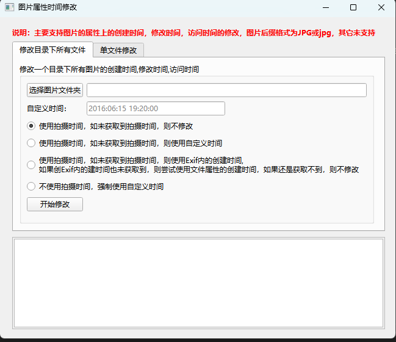

# ModifPhotoTime
用于修改图片文件属性中的创建时间,修改时间,访问时间


打包方式：
``` cpp
#powershell 进入虚拟环境：
.\venv\Scripts\Activate.ps1
#打包
pyinstaller --onedir --hidden-import=win32timezone --noconsole widget.py 
```

构建环境：
使用PySide6

界面


